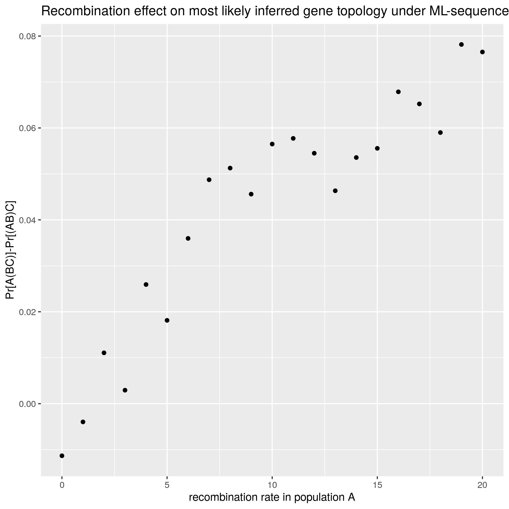
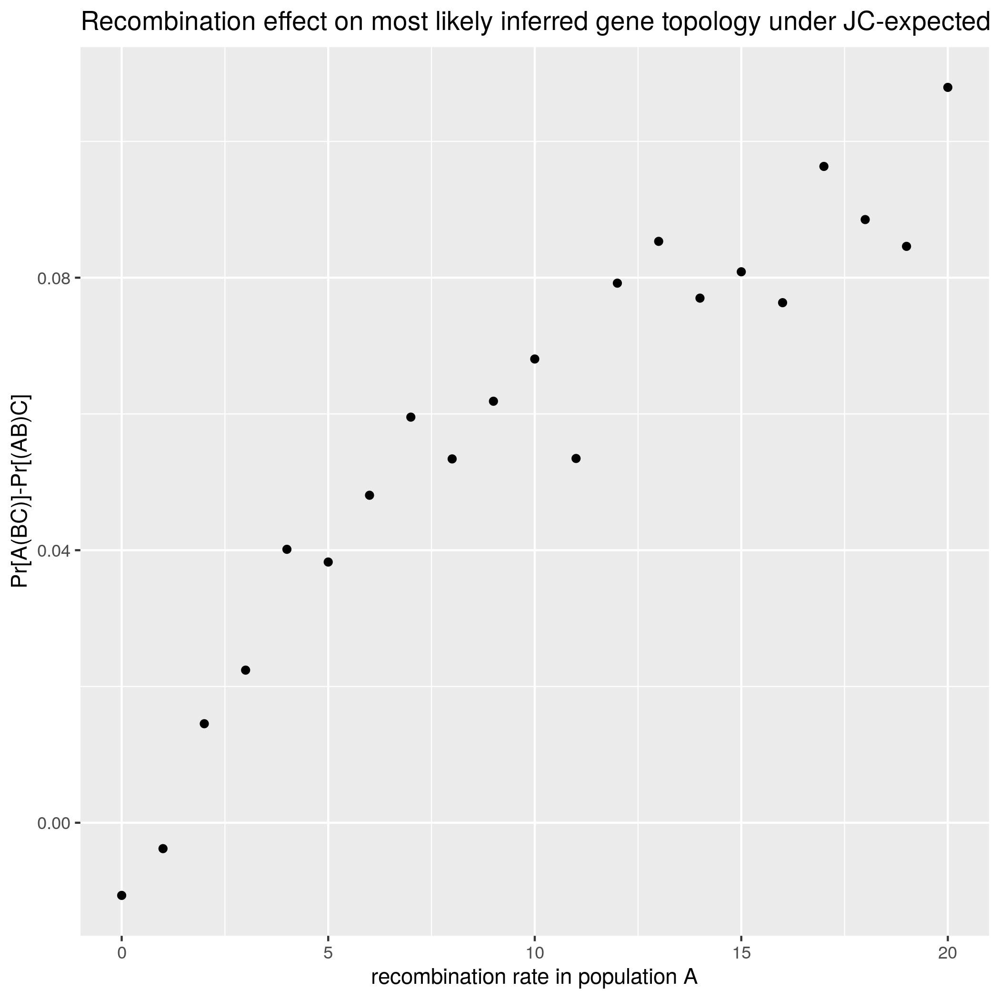
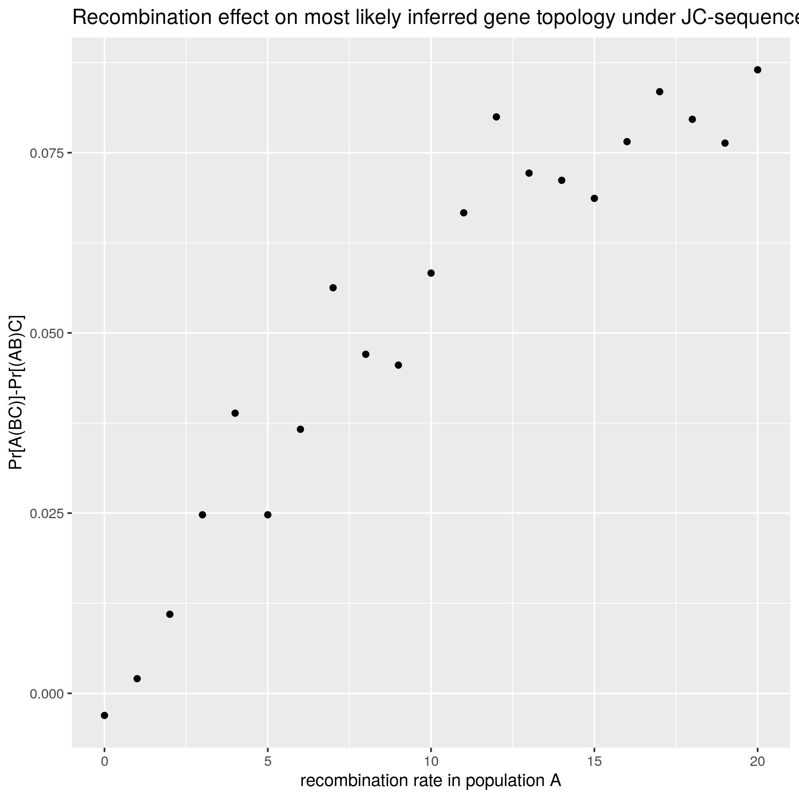
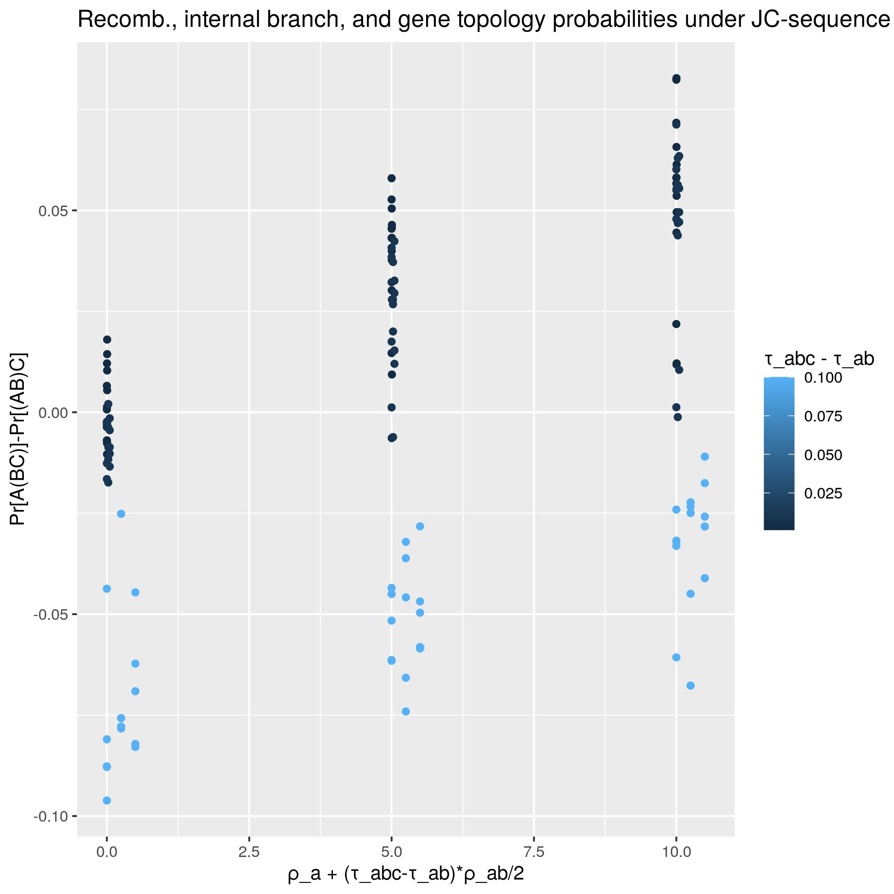
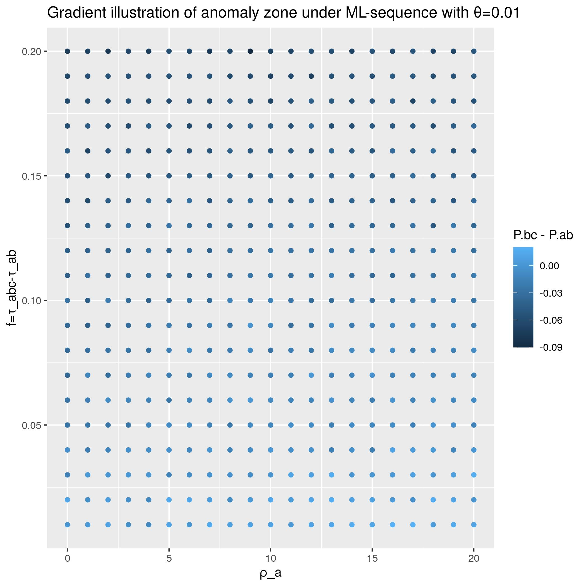
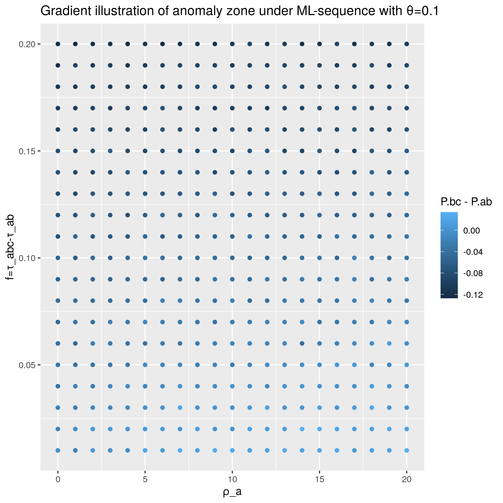
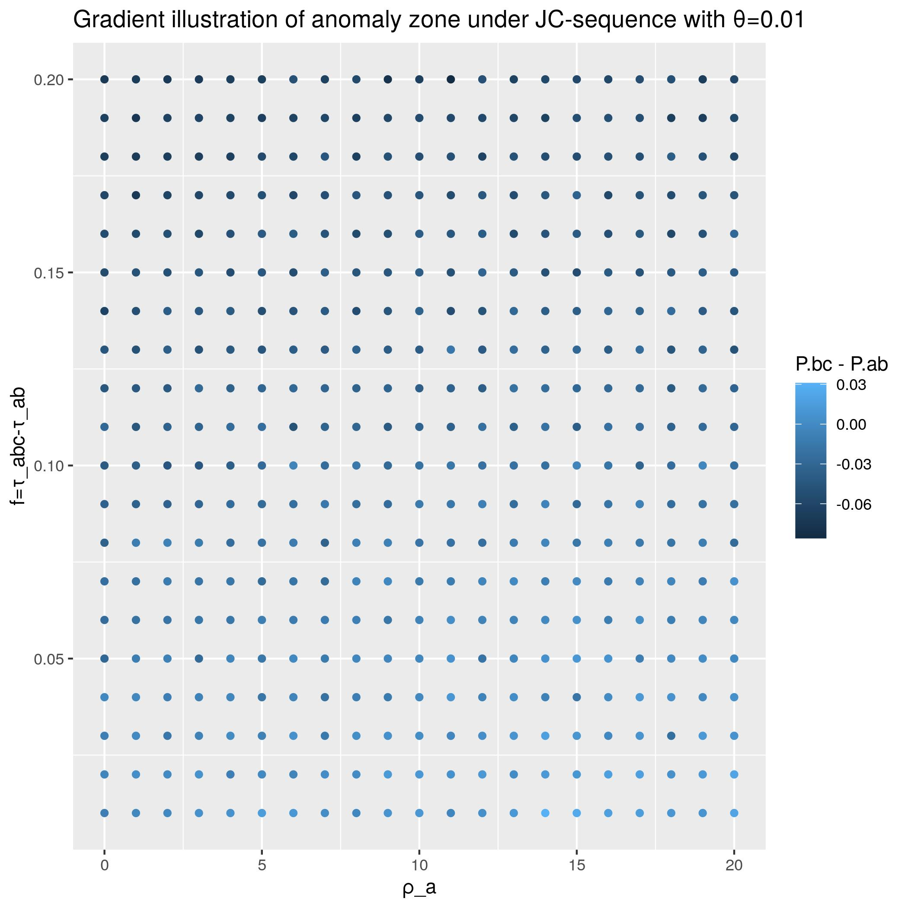
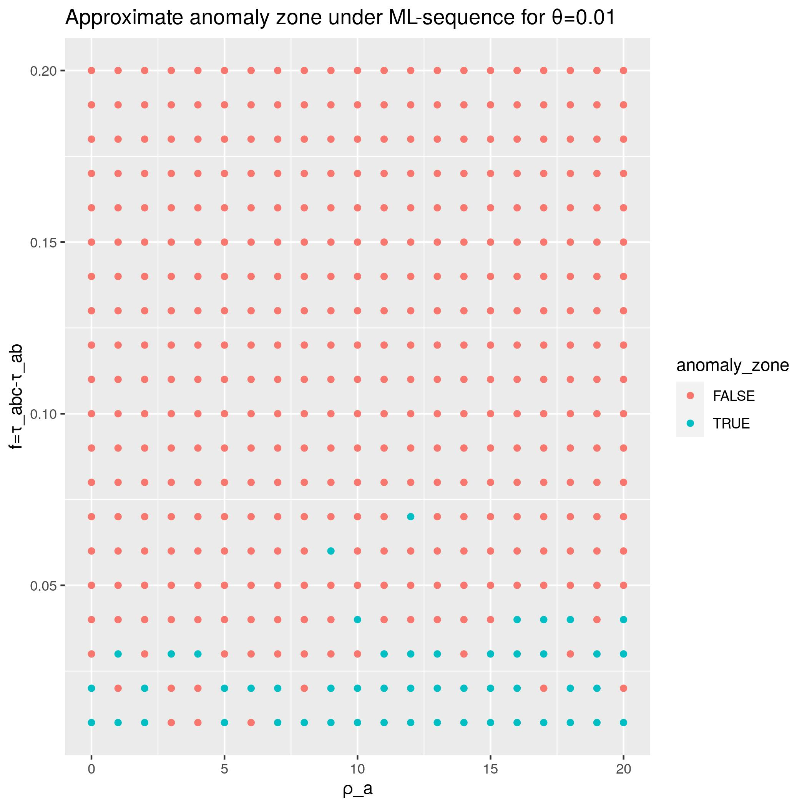

# Project Notebook
(Last updated: 2021-04-09)

## Background and Research Question

Broadly speaking, phylogenetic inference using summary tree methods involves a
two-step process. First, observed gene sequences are used to construct a
collection of 'gene trees', each representing the evolution of a single gene (or
'locus'). Second, a species tree is inferred from the gene trees by looking at
some informative property of the gene trees, such as the most commonly-observed
rooted species tripets or unrooted species quartets. Provided that the gene
trees are estimated without error, such methods are generally statistically
consistent, meaning that the inferred species tree converges to the true species
tree as the number of sampled genes increases (Warnow 2018, Chapter 10.5).

In my project, I investigate the robustness of such methods when certain
assumptions they make about gene trees are violated. Each gene tree is thought
to represent the ancestry of a collection of orthologous genes observed in the
sequence data. For example, a protein-coding gene which existed in the genome of
the MRCA of humans, chimps, and gorillas may have evolved in such a way that the
human, chimp, and gorilla genomes that exist today exhibit three slightly
different (but related) versions of this gene. If the human and chimp versions
are the most similar, then the corresponding gene tree would have topology
((HC)G) and branch lengths determined by the degree of genetic difference
between the three gene versions. In real biological terms, this gene tree
represents the idea that the two versions of the gene observed in humans and
chimps descend from an ancestor gene that existed more recently than any common
ancestor of either gene copy with that found in gorillas.

One assumption here is that gene ancestries can be accurately represented by
_trees_, as opposed to more general graphs. In order to be valid, this
assumption requires that any individual carrying a given gene inherited the
_entire gene_ from one parents or the other. However this may not be
biologically reasonable. For example recombination may cause a child to inherit
part of their gene from one parent and part from the other. To what extent does
such intralocus recombination present a challenge to phylogenetic inference? In
particular, does it present a significant impediment to correct topological
inference when using summary gene tree coalescent methods?

I hope to make a contribution to the ongoing debate regarding these questions.
On one hand, it is well-established that summary methods based on the most
commonly occuring species triplets or species quartets are consistent for
estimating the unrooted species tree from gene trees generated under the
multispecies coalescent, a model does not allow for intralocus recombination
(see Warnow 2018, Chapter 10.5). By contrast, I have previously shown (not in
this project) that when when intralocus recombination is allowed, there exist
parameter regimes in which those summary methods (e.g. based on the most
commonly-occuring rooted triplets, unrooted quartets, and maximum-likelihood
trees) fail to infer the correct species tree. In this project I seek to use
simulation to characterize the zone of parameters in which these methods fail in
order to better understand the effect of intralocus recombination on species
tree inference.

## Methods and Data
In this project we use simulated genetic data, generated under conditions of
intralocus recombination, to estimate the effectiveness of three inference
methods under a variety of parameter regimes. We use simulated data because it
allows us to (1) precisely specify the parameter regime (i.e., the species tree,
mutation rate, and recombination rates) and (2) directly test whether a given
inference method correctly inferred the species tree.

In order to allow for intralocus recombination, we simulate gene trees using a
modification of the multispecies coalescent based on an important model of gene
recombination called the Ancestral Recombination Graph (ARG) introduced by
Griffiths and Marjoram (1997). In all simulations, the data is generated from a
known species tree with three species A, B, and C with topology ((AB)C), as this
allows us to test the correctness of the various inference methods. Restricting
our analysis to the case of three species is not a significant limitation since
it is relatively easy to generalize these theoretical results to larger numbers
of taxa.

## Inference methods
A brief description of the main steps of each inference method is provided
below. For each inference method, we repeat the given steps many times in order
to obtain an estimate of how likely the inference method is to correctly infer
the true topology (vs the two incorrect topologies) under that parameter regime. 
(We then repeate this process for many different parameter regimes.)

#### Consensus Maximum Likelihood
1. Simulate an ARG with parameter regime specified in 'simulation-parameters.lisp'.
2. Conditional on the simulated ARG, generate a binary 'gene sequence' for each
   extant species by simulating a symmetric mutational process.
3. Using the simulated sequences, infer the maximum-likelihood tree topology.
   This step is performed analytically using site frequency data via the method
   described in Table 4 of Yang (2000).

#### R* (rooted triples) with sequence distances
1. Simulate an ARG with parameter regime specified in 'simulation-parameters.lisp'.
2. Conditional on the simulated ARG, use the Jukes-Cantor (1969) substitution
   model to generate a sequence (with letters A,T,C,G) for each extant species.
3. Use the pairwise (Hamming) distances between sequences to infer a species tree
   topology. In particular, since there are only three species, this is
   determined by whichever pairwise distance is the smallest.

#### R* (rooted triples) with expected distances
1. Simulate an ARG with parameter regime specified in 'simulation-parameters.lisp'.
2. Conditional on the simulated ARG, and assuming the Jukes-Cantor (1969) model
   of site evolution, compute the expected pairwise uncorrected evolutionary
   distances between species.
3. Infer a species tree with R* method based on those expected distances.


### Additional method
An important paper in this area (Lanier and Knowles 2012) concluded that
intralocus recombination is not a significant source of phylogenetic conflict
and may be safely disregarded. I would like to replicate some of their analyses
(using *BEAST) but have not got to that. Preliminary insights from some of the
simulations I have run lead me to suspect that certain parameter regimes which
they did not consider in their analysis may be significant.


## Reproducing the pipeline
To replicate or extend my results, clone this repository and follow the
step-by-step instructions below.

### Step 1. Setup


#### Install SBCL
We need to install SBCL, the Common Lisp implementation used by our
simulator. If you are running Ubuntu/Debian, simply run the command

```
sudo apt-get install sbcl
```

If you are running OS X, run the command 

```
brew install sbcl
```

If you are running a different operating system, instructions can be found at
[https://lisp-lang.org/learn/getting-started/](https://lisp-lang.org/learn/getting-started/).
(Note that you do not need to install Quicklisp, Emacs, or SLIME.)


#### Install R and ggplot2
We will use R and the R package ggplot2 to make plots. To install R on Debian (and probably Ubuntu), run the command

```
sudo apt-get install r-base
```

More detailed instructions for installing R can be found at [https://cloud.r-project.org/](https://cloud.r-project.org/).

To install the R package ggplot2, run the command

```
sudo apt-get install r-basesudo su - -c "R -e \"install.packages('ggplot2', repos='http://cran.rstudio.com/')\""
```

I have no idea how to do this on other operatings systems.


### Step 2. Simulate the Data

To run a simulation using the default simulation parameters (i.e. those
specified in the file
[simulation-parameters.lisp](scripts/simulation-parameters.lisp)), navigate to
the scripts/ directory and run the command

```
bash simulate.sh X
```

where X=0,1, or 2. [NOTE: as of 2021-04-09 only X=0 works]. The input X
determines which type of inference method is performed, according to the
following table:

```
 X  Inference method
(0) Consensus Maximum Likelihood
(1) R* with sequence distances
(2) R* with expected distances
```

Optionally, if you wish to supply your own parameter values, you will need to edit
the file [simulation-parameters.lisp](scripts/simulation-parameters.lisp) to
assign custom parameter values. Instructions and examples are provided as
commentary in the file itself.

By default the simulator will consider all possible combinations of
recombination rate assignments specified in
[simulation-parameters.lisp](scripts/simulation-parameters.lisp), which means
that it will loop over many parameter regimes. Depending on the values you
choose, this process may take some time. The simulator will track its progress
by printing out a number each time it completes a parameter regime.

Upon completion, a single .csv file is created, located in the `data/`
directory. The name of this output file will depend on the choice of parameter
regime and inference type chosen. For further information, including how to
interpret the rows and columns of the datafiles, see the [data
readme](data/readme.md).

### Step 3. Generate Plots

After running at least one simulation, we can make plots using the R script
[make-plots.R](scripts/make-plots.R), which will iterate over all .csv files in
`data/` and make a plot for each one. To run it, navigate to the `scripts/`
directory and run the command

```
Rscript make-plots.R
```

This will output a plot, located in the `analysis/` directory.

[Note: as of 2021-04-09, running step 3 won't create a particularly intersting
plot for the default parameter values, but right now provides just the basic
scaffolding for automated plot creation using ggplot2, which I am still learning
how to use.]


## Results
### Part 1: Effect of recombination when all other variables are fixed and internal branch length is small. 

For our first plots, we ran the simulation for each of the three settings with parameters

````
(defparameter *τ_ab-values* '(1))
(defparameter *f-values* '(.01))
(defparameter *ρ_a-values* '(0 1 2 3 4 5 6 7 8 9 10 11 12 13 14 15 16 17 18 19 20))
(defparameter *ρ_b-values* '(0))
(defparameter *ρ_c-values* '(0))
(defparameter *ρ_ab-values* '(0))
(defparameter *ρ_abc-values* '(0))
(defparameter *θ-values* '(.1)) 
(defparameter *N* 15000)
(defparameter *L* 500)
(defparameter *τ_max* 999999)
````






### Part 2: Relative effects of internal branch length and recombination rate on correct topological inference for gene triplets.

Simulation parameters

```` 
(defparameter *τ_ab-values* '(1))
(defparameter *f-values* '(.001 .01 .1))
(defparameter *ρ_a-values* '(0 5 10))
(defparameter *ρ_b-values* '(0))
(defparameter *ρ_c-values* '(0))
(defparameter *ρ_ab-values* '(0 5 10))
(defparameter *ρ_abc-values* '(0)) 
(defparameter *θ-values* '(.001 .01 .05 .1 .2))
(defparameter *N* 10000)
(defparameter *L* 500)
(defparameter *τ_max* 999999)
````

The next three plots give some indication of relative the effects of recombination rate of species A vs internal branch length on the species tree. In these simulations, the recombination rate in populations A and AB were either 0, 5, or 10, and zero recombination elsewhere. The color gradient represents the length of the internal branch in coalescent units (taking values 0.001, 0.01, or 0.1), with light blue being longer internal branch and black being shorter. The somewhat complicated expression for the x-axis is the expected number of recombination events which are ancestral to the sampled sequence from A under the root of the tree. The Y axis the the probability that the gene tree from a single locus is inferred to have topology A(BC) minus the probability that it is inferred to have topology (AB)C. The methods considered here are statistically consistent only if this difference is negative.  While a positive relationship is observed as the recombination rates increase, the effect appears overwhelmed by the relatively small absolute (but order-of-magnitude) increases in branch length.





### Part 3: Identifying the anomaly zones with gradient illustrations

````
(defparameter *τ_ab-values* '(1))
(defparameter *f-values* '(.01 .02 .03 .04 .05 .06 .07 .08 .09 .1 .11 .12 .13 .14 .15 .16 .17 .18 .19 .2))
(defparameter *ρ_a-values* '(0 1 2 3 4 5 6 7 8 9 10 11 12 13 14 15 16 17 18 19 20))
(defparameter *ρ_b-values* '(0))
(defparameter *ρ_c-values* '(0))
(defparameter *ρ_ab-values* '(0))
(defparameter *ρ_abc-values* '(0)) 
(defparameter *θ-values* '(.1 .01)) 
(defparameter *N* 10000) 
(defparameter *L* 50) 
(defparameter *τ_max* 999999)
````

In the next twelve plots, we seek a graphical representation of the anomaly zone for inference of the rooted triplet toplogy under each of the three methods. The first six plots provide a color gradient which indicates the difference P[A(BC)]-P[(AB)C], with x and y axes representing recombination rate in population A and internal branch length of the species tree respectively. Each dot represents an estimate of P[A(BC)]-P[(AB)C] obtained by simulated 10,000 ARGs for loci of length 50bp. 

To understand the meaning of the color gradient in the following plots, note that if P[A(BC)]-P[(AB)C]>0 then P[A(BC)]>P[(AB)C], and hence the most frequently-observed gene tree topology will not be the topology A(BC) which matches the species tree. Hence the light blue areas (bottom right on all six graphs) are the area where we expect consensus-based methods to fail.

#### ML-sequence



#### JC-expected


#### JC-sequence



Although not visible from the above graphs, in almost all the cases simulated, the region of parameter space satisfying P[A(BC)]<P[(AB)C] tends to coincide with the region satisfying P[A(BC)] > max(P[(AB)C], P[(AC)B]). Exceptions to this appear to be the result of random noise owing to insufficent convergence of the simulation's probability estimates, such as in cases where recombination and internal branch length are both very small and hence all three topologies have inference probabilities extremely close to 1/3. This suggests that **the higher differential rate of recombination occurring in population A compared to other populations tends to make it more probable that A is inferred to be the outgroup in the triplet topology.** However the effect is very small: even when P[A(BC)]-P[(AB)C] is positive, in the the graphs presented we have P[A(BC)]-P[(AB)C]<0.1. [As an additional note, the most extreme values I have found in any simulations are in the realm of P[A(BC)] ~ 0.4 and P[(AB)C] ~ 0.3. In no simulation have I yet observed P[A(BC)] > 0.5.]

### Part 4 -- Discrete illustrationss of anomaly zone for inference of rooted triplet topology

````
Parameters same as for part 3.
````

The following graphs help to illustrate the approximate anomaly zone for
θ=0.1, where anomaly zone is defined as the set of parameters for which the
topology ((AB)C) [i.e. matching that of the species tree] is not the most
likely topology to be exhibited by individual gene trees. In all cases
observed, the anomaly zone coincides almost entirely with the region in which
the most likely gene tree topology is (A(BC)). For JCE, exceptions to this
rule appear to be the result of random noise due to insufficent convergence
when f is very close to zero. In all cases, the anomaly zone is indicated by
the color teal.

#### JC-expected


In these two above plots, the anomaly zone appears larger when θ is smaller.
This is consistent with analytical results (not included in this project report)
that I have previously obtained in which I have found that in the JC-expected
case, the difference P[A(BC)]-P[(AB)C] is a decreasing function of θ on the
interval [0,3/4].

#### ML-sequence



#### JC-sequence


The anomaly zone for JC-sequence is smaller than that for JC-expected, but
appears to follow the same qualitative pattern. When the internal branch is
short (e.g. less than .05 coalescent units), more recombination in population A
has the effect of producing anomolous gene trees, but this effect is small and
completely overwhelmed by the effect of increasing the internal branch length.

One difference between this case and that of JCE is that for JCS, the anomaly
zone appears to decrease in size as we go from θ=0.1 down to θ=0.01. This
also appears to be the case in the graphs for MLS. However the opposite
behavior occurs in the JCE case. The most plausible explanation that I have
for such behavior is that the sample size of the simulation is too low for
JCS to overcome higher variance in the probability estimates inherent under
JCS and MLS compared to JCE. This is due to their actually simulating
sequences with random mutations from the marginal gene trees, whereas JCE
infers gene tree topologies using expected differences between sequences.


The mutation rates of 0.1 and 0.01 considered here are *rate per site per
coalescent unit*. Typical mutation rates for eukaryotes are on the order of
10^(-8) or 10^(-9) per site per generation (Hahn 2019, citing M. Lynch, from
"Evolution of the mutation rate. Trends in Genetics, 2010). Therefore assuming
an effective population size on the order of 10,000 for human, the mutation
rates considered here are an order of magnitude or two larger than current
estimates of human mutation rates. Due to higher variance when mutation rates
are low, longer simulations with more samples will be requied to characterize an
anomaly zone for those smaller mutation rates. Nonetheless, these values may be
realistic for other eukaryotes with effective population sizes larger than that
for homo sapiens.

## Sources

* Robert C Griffiths and Paul  Marjoram, "An Ancestral Recombination Graph" in Progress in population genetics and human evolution, Springer, 1997. Online at [http://lamastex.org/recomb/ima.pdf](http://lamastex.org/recomb/ima.pdf)

* Hayyley C. Lanier, L. Lacey Knowles, "Is Recombination a Problem for Species-Tree Analyses?",  Systematic Biology, Volume 61, Issue 4, July 2012, Pages 691–701, https://doi.org/10.1093/sysbio/syr128

* Tandy Warnow, _Computational Phylogenetics_, Cambridge University Press, 2018. 

* Ziheng Yang, Complexity of the simplest phylogenetic estimation problem, Proc Biol Sci. 2000 Jan 22; 267(1439): 109–116. Online at [https://www.ncbi.nlm.nih.gov/pmc/articles/PMC1690513/](https://www.ncbi.nlm.nih.gov/pmc/articles/PMC1690513/)
