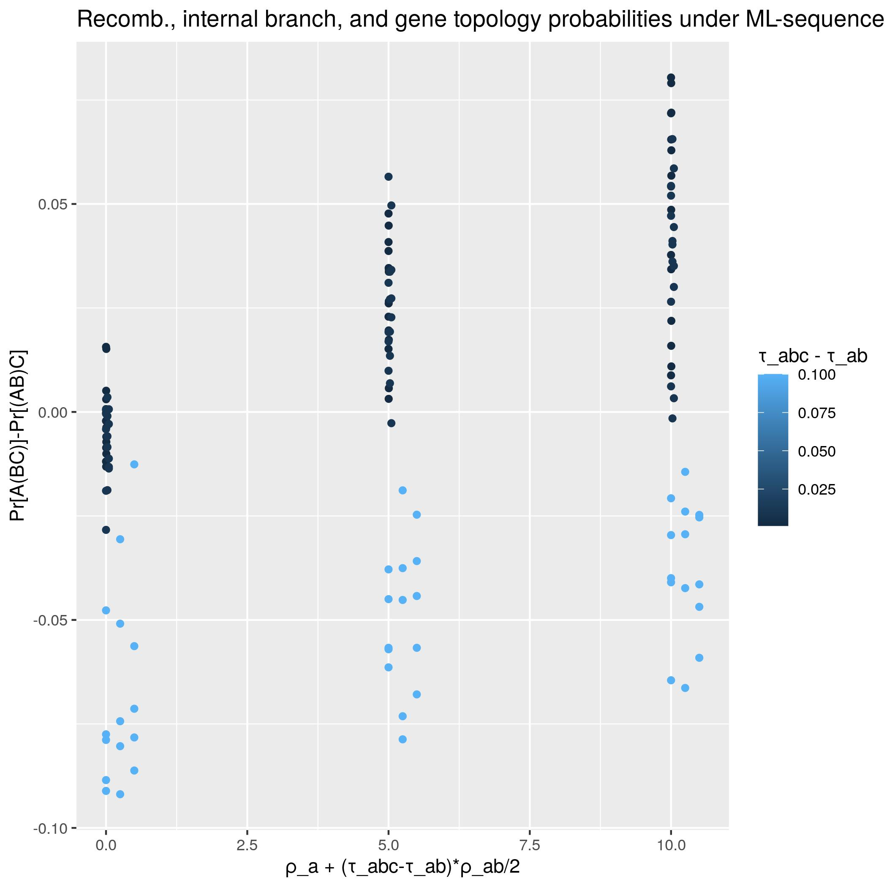
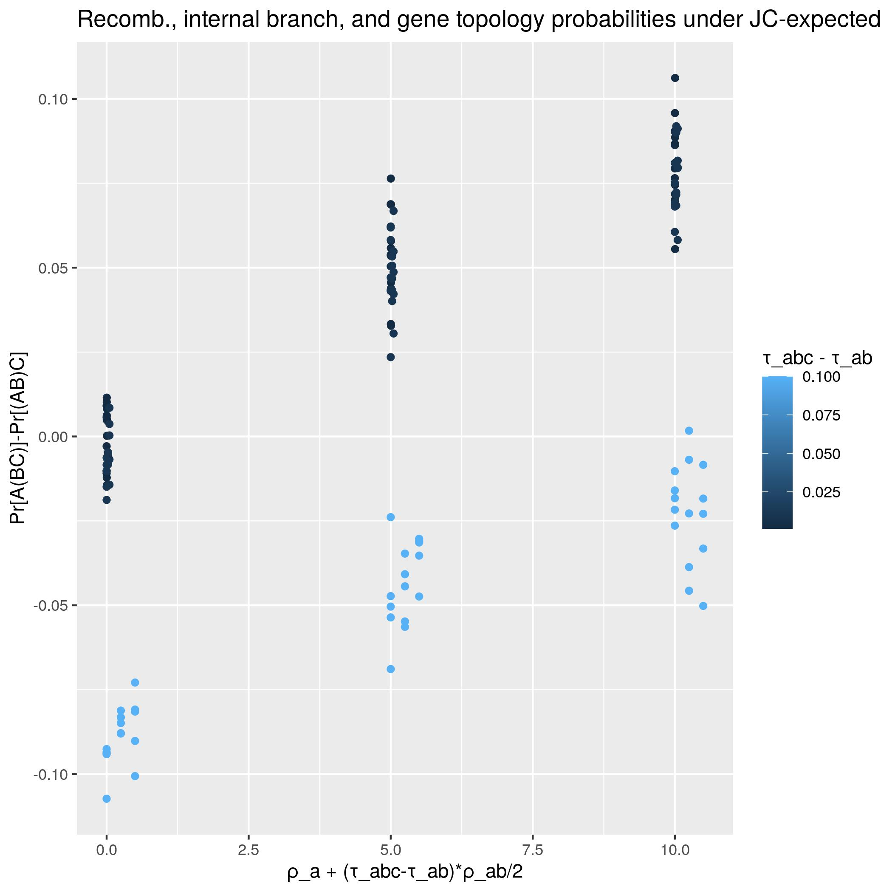
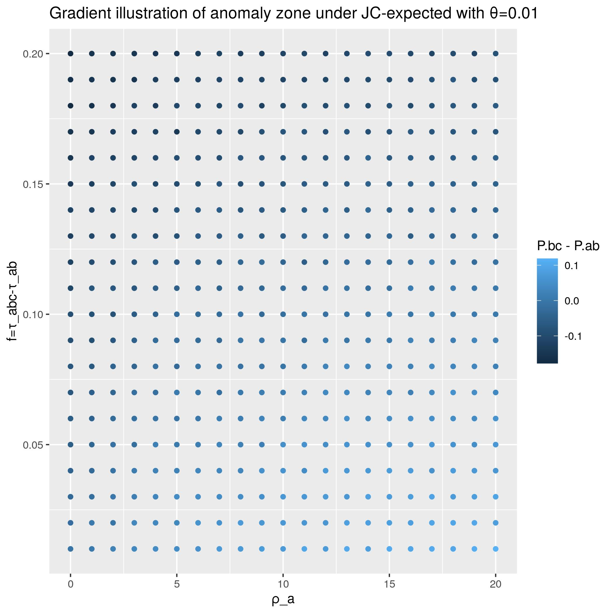
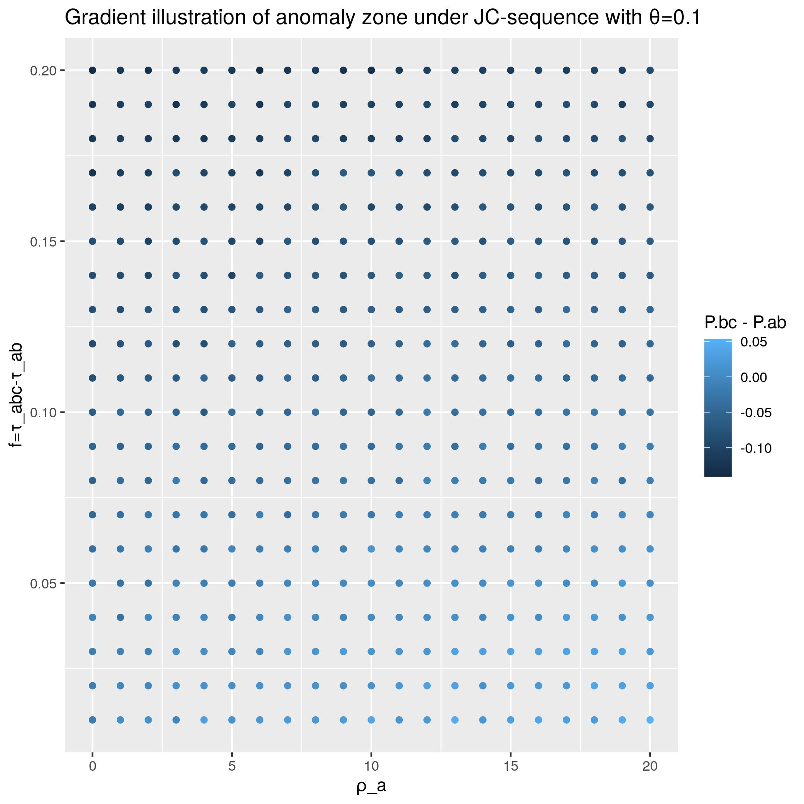

# Project Report
(Last updated: 2021-04-30)

## Abstract
In this project I simulate genetic data subject to intralocus recombination under various parameter regimes (mutation rate, species tree branch lengths, recombination rates, etc) in order evaluate the robustness of summary coalescent methods to violations of the "no intralocus recombination" assumption. I demonstrate the existence of an anomaly zone for the inference of rooted triplet tree topologies. The results also suggest that the anomaly zone may persist for some limited biologically plausible situations. Finally the simulations also suggest two factors necessary for anomalous gene trees: (1) very short internal branch length on the species tree, and (2) differential rates of recombination between related species. Additional, more involved simulations will be required to further test and characterize these results. 

## Background and Research Question

Broadly speaking, phylogenetic inference using summary tree methods involves a
two-step process. First, observed gene sequences are used to construct a
collection of 'gene trees', each representing the evolution of a single gene (or
'locus'). Second, a species tree is inferred from the gene trees by looking at
some informative property of the gene trees, such as the most commonly-observed
rooted species tripets or unrooted species quartets. Provided that the gene
trees are estimated without error, such methods are generally statistically
consistent, meaning that the inferred species tree converges to the true species
tree as the number of sampled genes increases (Warnow 2018, Chapter 10.5).

In my project, I investigate the robustness of such methods when certain
assumptions they make about gene trees are violated. Each gene tree is thought
to represent the ancestry of a collection of orthologous genes observed in the
sequence data. For example, a protein-coding gene which existed in the genome of
the MRCA of humans, chimps, and gorillas may have evolved in such a way that the
human, chimp, and gorilla genomes that exist today exhibit three slightly
different (but related) versions of this gene. If the human and chimp versions
are the most similar, then the corresponding gene tree would have topology
((HC)G) and branch lengths determined by the degree of genetic difference
between the three gene versions. In real biological terms, this gene tree
represents the idea that the two versions of the gene observed in humans and
chimps descend from an ancestor gene that existed more recently than any common
ancestor of either gene copy with that found in gorillas.

One assumption here is that gene ancestries can be accurately represented by
_trees_, as opposed to more general graphs. In order to be valid, this
assumption requires that any individual carrying a given gene inherited the
_entire gene_ from one parents or the other. However this may not be
biologically reasonable. For example recombination may cause a child to inherit
part of their gene from one parent and part from the other. To what extent does
such intralocus recombination present a challenge to phylogenetic inference? In
particular, does it present a significant impediment to correct topological
inference when using summary gene tree coalescent methods?

I hope to make a contribution to the ongoing debate regarding these questions.
On one hand, it is well-established that summary methods based on the most
commonly occuring species triplets or species quartets are consistent for
estimating the unrooted species tree from gene trees generated under the
multispecies coalescent, a model does not allow for intralocus recombination
(see Warnow 2018, Chapter 10.5). By contrast, I have previously shown (not in
this project) that when when intralocus recombination is allowed, there exist
parameter regimes in which those summary methods (e.g. based on the most
commonly-occuring rooted triplets, unrooted quartets, and maximum-likelihood
trees) fail to infer the correct species tree. In this project I seek to use
simulation to characterize the zone of parameters in which these methods fail in
order to better understand the effect of intralocus recombination on species
tree inference.

## Methods and Data

### Overview
In this project we use simulated genetic data, generated under conditions of
intralocus recombination, to estimate the effectiveness of three inference
methods under a variety of parameter regimes. We use simulated data because it
allows us to (1) precisely specify the parameter regime (i.e., the species tree,
mutation rate, and recombination rates) and (2) directly test whether a given
inference method correctly inferred the species tree.

In order to allow for intralocus recombination, we simulate gene trees using a
modification of the multispecies coalescent based on an important model of gene
recombination called the Ancestral Recombination Graph (ARG) introduced by
Griffiths and Marjoram (1997). In very rough terms, the ARG is similar to the
backwards-in-time coalescent but with the added possiblity that in addition to
pairs of lineages possibly coalescent, inidividual lineages may also 'split'
(i.e. recombine) in two parent lineages. 

### The Species Tree and Other Model Parameters
In all simulations for this project, the data is generated from a known rooted
species tree with three species A, B, and C and topology ((AB)C). This is
illustrated in the picture below. The species tree is assumed to have fixed
branch lengths, represented by a choice of divergence times τ_ABC and τ_AB.
There is a universal mutation parameter θ which represents the per-site
per-coalescent unit mutation rate. Recombination rates a chosen independently
for each of the five populations A, B, C, AB, and ABC. In principle, the species
tree is not assumed to have a fixed maximum height (though for the purpose of
the simulation we make do by choosing the maximum height to be an extremely
large number: 999999 coalescent units).


The reason for generating data from a fixed species tree is that it allows us to
test the correctness of the various inference methods that we will employ since
we will know whether or not they 'got it right'. Restricting our analysis to the
case of three species is not a significant limitation since it is relatively
easy to generalize these theoretical results to larger numbers of taxa, as we
discuss in the next subsection.

Other parameters include the number *N* of gene trees to generate per parameter
regime and the length *L* of each loci.

### Significance and Connection to Consensus Methods

We seek to evaluate the performance of consensus-based methods like R* which
seeks to reconstruct the topology of an n-taxa species tree through
reconstruction of the triplet topology for each triplet of taxa (by choosing the
most commonly-observed topology among the corresponding 3-taxa gene trees).
Under the multispecies coalescent model (i.e. with no intralocus recombination),
R* is known to consistently estimate of the species tree topology since "for any
set of 3 taxa, the rooted triple in the species tree is the highest probability
rooted triple in the gene-tree distribution" (Degnan et al 2009). Indeed,
assuming that evolutionary process for different loci is i.i.d., it follows by
the law of large numbers that R* consistently estimates the species tree if and
only if for each triplet of taxa, the most likely gene tree topology matches
that of the species tree. In symbols, we must have

```` 
P[(AB)C] > max( P[(AC)B], P[A(BC)] )
```` 

Therefore we shall be interested in simulating the evolution of a locus of DNA
many times independently under the same parameter regime, with the aim of
estimating how frequently the gene tree topology matches that of the species
tree. As we shall see, the simulations conducted support the existence of a
nonempty anomaly zone, i.e., a set of parameters for which the above inequality
does not hold, and hence R* is not guaranteed to converge to the true tree
topology in the rooted three-taxa case (and hence in the rooted n-taxa case).

Furthermore, the results from this project also has implications for the
consistency of quartet-based methods such as ASTRAL, as one can demonstrate
analytically that the existence of an anomaly zone for rooted triplets implies
the existence of an anomaly zone for unrooted quartets as well.

### Simulation Description
As noted, the simulation employed in this project seeks to repeatedly model the
evolution of a locus of DNA consisting of *L* base pairs on a species tree with
topology ((AB)C) when the possibility of intralocus recombination is present.
Each time it does this, the simulator then tries to infer a gene tree topology
using some method from the sequence data generated for the locus.

There are three simulation modes, essentially corresponding to three different
ways of inferring the gene tree topology from the generated data. We shall refer
to these three modes as **ml-sequence**, **jc-expected**, and **jc-sequence**.
To be more precise, the three modes differ in both the type of sequence data
they produce and the way that they infer a gene tree topology from each
individually simulated locus. All three modes are consensus-based in the sense
that we assume that the ultimate estimate of the species tree topology is chosen
to be the most commonly occuring gene tree topology. A detailed description of the
simulation procedure under each of the three modes is as follows:

  (0) ml-sequence (= maximum-likelihood with binary sequences):

      Given a fixed parameter regime, do the following three steps *N* times:
      first, simulate an ancestral recombation graph (ARG) with the given
      parameter regime. Second, use the ARG to generate binary DNA sequences
      for each taxa by modeling mutations under the symmetric model of site
      evolution (ie 1 mutates to 0 and 0 mutates to 1 at equal rates). Third, 
	  infer a gene tree topology from the sequence data by choosing what would
	  be the maximum-likelihood tree topology under the multi-species coalescent
	  with no intralocus recombination. (This case is interesting because it can
	  tell us what might go wrong if a researcher assumes their sequences have no
	  intralocus recombination, uses maximum likelihood, and that assumption
	  turns out to be wrong). In particular, the 'maximum-likelihood' tree is
	  obtained from site-frequency data using results from Yang 2000(ie Table 4
	  in that paper). 

  (1) jc-expected (= expected Hamming distances under the JC69 model of site
                   evolution):

      Given a fixed parameter regime, do the following three steps *N* times:
      first, simulate an ARG with the given parameter regime. Second,
      conditional on the simulated ARG, and assuming the Jukes-Cantor (1969)
      model of site evolution, compute the expected Hamming distances between
      sequences. (This step uses a formula based on coalescent times and
      locations of recombination events on the ARG and does not require
      sequences to be generated). Third, infer a topology using the rule that
      the two taxa with the smallest expected difference are most closely
      related.

  (2) jc-sequence (= Hamming distances under the JC69 model of site evolution):

      For each parameter do the following four steps *N* times: first,
      simulate an ARG with the given parameter regime. Second, for each taxa
      generate a nucleotide sequence with possible bases A,T,C, and G by
      simulating the Jukes-Cantor process on each marginal gene tree of the
      ARG. Third, compute the Hamming distance between the sequences for each
      taxa. Fourth, infer a tree topology using the rule that the two taxa
      with the smallest Hamming distance are most closely related.

Having completed (0), (1), or (2), the program then records the proportion of
the *N* samples which resulted in correct topological inference vs inferred
incorrect topologies. That is, for each of the three possible topologies
((AB)C), ((AC)B) and ((BC)A), it records the fraction of samples for which that
topology was inferred. Such information is recorded in a single row in an output
file in csv format. Additional information about the parameter regime that was
used is also recorded in the same row of the csv. The simulator then moves on to
the next parameter regime and repeats the process to generate the next row of
the csv. For detailed description of the output file see the [data
readme](data/readme.md)

### Assumptions and Choice of Models
The Ancestral Recombination Graph model used has the advantage of allowing for
intralocus recombination, but it suffers from other assumptions common to the
multispecies coalescent, such as the assumption of panmixia within species and
discrete speciation events with no introgression/horizontal gene transfer
between species. The model here also assumes that recombination events are
equally likely to occur at any site on the gene locus, which is problematic
given the existence of recombination hotspots.

Genetic data (e.g. gene sequences) is generated using the Jukes-Cantor 1969
process or an even simpler symmetric process which generates binary sequences.
Both the Jukes-Cantor substitution model and the symmetric binary sequence model
were chosen for simplicity. In particular, the binary sequence process was
chosen because according to Yang (2000), it is the only case where we can
compute the maximum-likelihood gene trees explicity from site frequency data.

Both mutational models make very strong assumptions about mutation rates being
the same at all sites on the genome and at all times in the past. This means,
for example, that they assume that no sites are conserved more than other side.

As we shall see, another important assumption, made in the choice of simulations
parameters, is that recombination rates may vary significantly between closely
related taxa. I do not know the extent to which this is a reasonable or not.

## Results and Discussion
The results and discussions are organized into four sections based on the nature of the plots
produced in simulation runs.


### Part 1: Effect of recombination when all other variables are fixed and internal branch length is small. 

For our first plots, we ran the simulation for each of the three settings with
parameters:

````
(defparameter *τ_ab-values* '(1))
(defparameter *f-values* '(.01))
(defparameter *ρ_a-values* '(0 1 2 3 4 5 6 7 8 9 10 11 12 13 14 15 16 17 18 19 20))
(defparameter *ρ_b-values* '(0))
(defparameter *ρ_c-values* '(0))
(defparameter *ρ_ab-values* '(0))
(defparameter *ρ_abc-values* '(0))
(defparameter *θ-values* '(.1)) 
(defparameter *N* 15000)
(defparameter *L* 500)
(defparameter *τ_max* 999999)
````

The range of recombination parameters for ρ_a in this simulation encompasses
biologically plausible values, with in particular nonviral lineages exhibiting a
range of 0 to 11 (according to Strumpf and McVean 2003, quoted in Lanier and
Knowles 2011). The population mutation rate θ may be somewhat higher than
typical biological data; according to Schierup and Hein (2000), a value of 0.01
might represent that of a typical nuclear dtaset and 0.05 for viral dataset.

In all three cases we obtained similar a similar result. When the internal
branch of the species tree is very small and recombination occurs only in the
pendant edge of the species tree corresponding to species A, then the following
conclusions hold:

* under even relatively low recombination rates (i.e. less than 5) the
  probability of a gene tree exhibiting the topology (AB)C which matches that of
  the species tree is less than the probability of it exhibiting the incorrect
  topology (AB)C; and

* this effect grows as the recombination rate increases.

  


### Part 2: Relative effects of internal branch length and recombination rate on correct topological inference for gene triplets.

For this part we use the simulation parameters as follows:

```` 
(defparameter *τ_ab-values* '(1))
(defparameter *f-values* '(.001 .01 .1))
(defparameter *ρ_a-values* '(0 5 10))
(defparameter *ρ_b-values* '(0))
(defparameter *ρ_c-values* '(0))
(defparameter *ρ_ab-values* '(0 5 10))
(defparameter *ρ_abc-values* '(0)) 
(defparameter *θ-values* '(.001 .01 .05 .1 .2))
(defparameter *N* 10000)
(defparameter *L* 500)
(defparameter *τ_max* 999999)
````

The next three plots give some indication of relative the effects of
recombination rate of species A vs internal branch length on the species tree.
In these simulations, the recombination rate in populations A and AB were either
0, 5, or 10, and zero recombination elsewhere. The color gradient represents the
length of the internal branch in coalescent units (taking values 0.001, 0.01, or
0.1), with light blue being longer internal branch and black being shorter. The
somewhat complicated expression for the x-axis is the expected number of
recombination events which are ancestral to the sampled sequence from A under
the root of the tree. The Y axis the the probability that the gene tree from a
single locus is inferred to have topology A(BC) minus the probability that it is
inferred to have topology (AB)C. The methods considered here are statistically
consistent only if this difference is negative. While a positive relationship is
observed as the recombination rates increase, the effect appears overwhelmed by
the relatively small absolute (but order-of-magnitude) increases in branch
length.

  


### Part 3: Identifying the anomaly zones with gradient illustrations

In this and the next section, we attempt to (begin to) characterize the anomaly
zone for inference of the rooted triplet toplogy under each of the three
methods. By anomaly zone, we mean the set of parameter regimes for which the
triplet topology (AB)C matching that of the species tree is not the most likely
topology to be exhibited by individual gene trees.

A difficulty with having a model with many parameters is that it requires choice
about which parameters to focus on and which to control. Here we consider two
values of mutation (θ=0.01 and θ=0.1) and vary only the parameters f and ρ_a,
the internal branch length and recombination rate of population A respectively.
The specific parameter ranges we use are as follows:


````
(defparameter *τ_ab-values* '(1))
(defparameter *f-values* '(.01 .02 .03 .04 .05 .06 .07 .08 .09 .1 .11 .12 .13 .14 .15 .16 .17 .18 .19 .2))
(defparameter *ρ_a-values* '(0 1 2 3 4 5 6 7 8 9 10 11 12 13 14 15 16 17 18 19 20))
(defparameter *ρ_b-values* '(0))
(defparameter *ρ_c-values* '(0))
(defparameter *ρ_ab-values* '(0))
(defparameter *ρ_abc-values* '(0)) 
(defparameter *θ-values* '(.1 .01)) 
(defparameter *N* 10000) 
(defparameter *L* 50) 
(defparameter *τ_max* 999999)
````

The following six plots provide a color gradient which indicates the difference
P[A(BC)]-P[(AB)C], with x and y axes representing recombination rate in
population A and internal branch length of the species tree respectively. Each
dot represents an estimate of P[A(BC)]-P[(AB)C] obtained by simulated 10,000
ARGs for loci of length 50bp.

To understand the meaning of the color gradient in the following plots, note
that if P[A(BC)]-P[(AB)C]>0 then P[A(BC)]>P[(AB)C], and hence the most
frequently-observed gene tree topology will not be the topology A(BC) which
matches the species tree. Hence in the light blue areas (bottom right on all six
graphs) we expect consensus-based methods to fail.

#### ML-sequence
 

#### JC-expected
 

#### JC-sequence
 

Although not visible from the above graphs, in all the cases simulated, the
region of parameter space satisfying P[A(BC)]<P[(AB)C] coincides almost entirely
with the region satisfying P[A(BC)] > max(P[(AB)C], P[(AC)B]). Exceptions to
this appear to be the result of random noise owing to insufficent convergence of
the simulation's probability estimates, such as in cases where recombination and
internal branch length are both very small and hence all three topologies have
inference probabilities extremely close to 1/3. This supports the hypothesis
that higher differential rate of recombination occurring in population A
compared to other populations tends to make it more probable that A is inferred
to be the outgroup in the gene tree topology. 

However these plots, as well as the plots from parts 1 and 2, indicate that
effect of recombination is very small: even when P[A(BC)]-P[(AB)C] is positive,
in the the graphs presented it is rarely greater than 0.1 (the lone exception
can be found on the graph for JC-expected in part 2). The most extreme values I
have found in any simulations run thus far are in the realm of P[A(BC)] ~ 0.4
and P[(AB)C] ~ 0.3. [Examples of such parameter regimes can be found at the end
of the document [plotmaker.R](scripts/plotmaker.R).] In no simulation have I yet
observed P[A(BC)] > 0.5, which suggests that strict-majority based inference
methods may be robust to the effects observed here. On the other hand, the cases
where the recombination effect is evident---i.e. those cases where the internal
branch length is very small---are precisely those difficult-to-resolve cases
where we might expect all three triplet topologies to occur roughly equally
often, and in that case such methods are likely to be indeterminate.

### Part 4 -- Discrete illustrations of anomaly zone for inference of rooted triplet topology

````
Parameters same as for part 3.
````

The following graphs help to illustrate the approximate anomaly zone for θ=0.01
and θ=0.1, as with the previous section. The anomaly zone is represented in
teal; its complement is represented in red. The graphs in this section differ
from those of the previous section not only in that we use an easier-to-see
categorial coloring scheme, but also that we are graphing the zone for which

 `P[(AB)C] <  max(P[(AC)B], P[A(BC)])`

rather than simply considering the sign of the difference

 `P[A(BC)] - P[(AB)C]`.
 
However there is broad similarity, since in all cases observed, the anomaly zone
coincides with the region in which the most likely gene tree topology is (A(BC)).


#### JC-expected
 

In these two above plots, the anomaly zone appears larger when θ is smaller.
This is consistent with analytical results (not included in this project report)
that I have previously obtained in which I have found that in the JC-expected
case, the difference P[A(BC)]-P[(AB)C] is a decreasing function of θ on the
interval [0,3/4].

#### ML-sequence
 

#### JC-sequence
 


The anomaly zone for JC-sequence is smaller than that for JC-expected, but
appears to follow the same qualitative pattern. When the internal branch is
short (e.g. less than .05 coalescent units), more recombination in population A
has the effect of producing anomolous gene trees, but this effect is small and
completely overwhelmed by the effect of increasing the internal branch length.

One difference between this case and that of JC-expected is that for JC-sequence, the anomaly
zone appears to decrease in size as we go from θ=0.1 down to θ=0.01. This
also appears to be the case in the graphs for ML0sequence. However the opposite
behavior occurs in the JC-expected case. The most plausible explanation that I have
for such behavior is that the sample size of the simulation is too low for
JC-sequence to overcome higher variance in the probability estimates inherent under
JC-sequence and ML-sequence compared to JC-expected. This is due to their actually simulating
sequences with random mutations from the marginal gene trees, whereas JCE
infers gene tree topologies using expected differences between sequences.

The mutation rates of 0.1 and 0.01 considered here are *rate per site per
coalescent unit*. Typical mutation rates for eukaryotes are on the order of
10^(-8) or 10^(-9) per site per generation (Hahn 2019, citing M. Lynch, from
"Evolution of the mutation rate. Trends in Genetics, 2010). Therefore assuming
an effective population size on the order of 10,000 for human, the mutation
rates considered here are an order of magnitude or two larger than current
estimates of human mutation rates. Due to higher variance when mutation rates
are low, longer simulations with more samples will be requied to characterize an
anomaly zone for those smaller mutation rates. Nonetheless, these values may be
realistic for other eukaryotes with effective population sizes larger than that
for homo sapiens.

## References
* Degnan, James H., Michael DeGiorgio, David Bryant, and Noah A. Rosenberg,
  "Properties of Consensus Methods for Inferring Species Trees from Gene Trees",
  Syst Biol. 2009 Feb; 58(1): 35–54. Online at [https://academic.oup.com/sysbio/article/58/1/35/1674751](https://academic.oup.com/sysbio/article/58/1/35/1674751)

* Griffiths and Marjoram, Robert C. and Paul, "An Ancestral Recombination Graph"
  in Progress in population genetics and human evolution, Springer, 1997. Online
  at [http://lamastex.org/recomb/ima.pdf](http://lamastex.org/recomb/ima.pdf)

* Hahn, Matthew W., Molecular Population Genetics, Oxford University Press, 2019.

* Lanier and Knowles, Hayley C. and L. Lacey., "Is Recombination a Problem for
  Species-Tree Analyses?", Systematic Biology, Volume 61, Issue 4, July 2012,
  Pages 691–701, https://doi.org/10.1093/sysbio/syr128

* Schierup and Hein, Mikkel H. and Jotun., Consequences of Recombination on
  Traditional Phylogenetica Analysis, Genetics 156: 879-891, (October 2000).

* Strumpf and McVean, M.P.H. and G.A.T., 2003., Estimating recomibnation rates
  from population-genetic data, Nat. Rev. Genet. 4:959-968

* Warnow, Tandy., _Computational Phylogenetics_, Cambridge University Press, 2018. 

* Yang, Ziheng., Complexity of the simplest phylogenetic estimation problem,
  Proc Biol Sci. 2000 Jan 22; 267(1439): 109–116. Online at [https://www.ncbi.nlm.nih.gov/pmc/articles/PMC1690513/](https://www.ncbi.nlm.nih.gov/pmc/articles/PMC1690513/)
